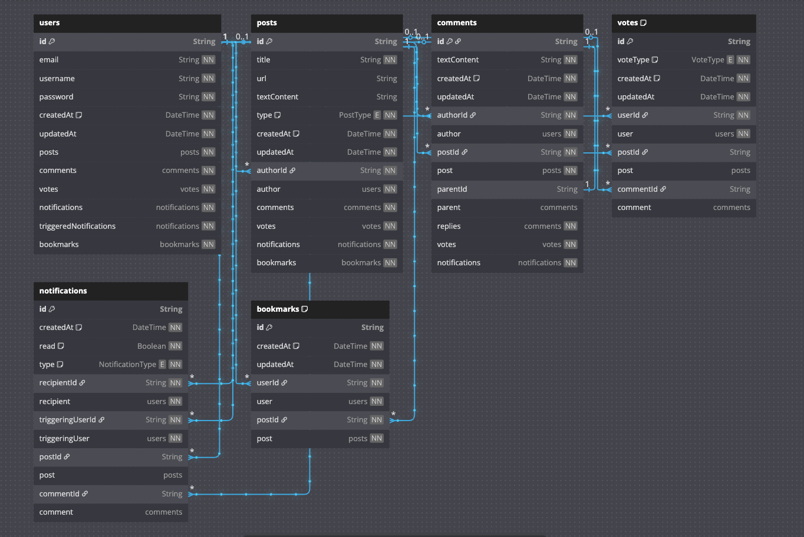

# Database Schema Details (Prisma)

This document provides a detailed explanation of the database schema for the Hackernews Clone, managed by Prisma and defined in `prisma/schema.prisma`.

## DBML Diagram

Below is a visual representation of the database schema using Database Markup Language (DBML). The diagram illustrates the tables, columns, and relationships.



*Link to live DBML diagram: [https://dbdiagram.io/d/682b8d141227bdcb4e07162f](https://dbdiagram.io/d/682b8d141227bdcb4e07162f)*

## Schema Definition: `prisma/schema.prisma`

The `prisma/schema.prisma` file is the single source of truth for the database structure. It includes:

*   **Generators:** Configuration for Prisma Client and tools like `prisma-dbml-generator`.
*   **Datasource:** Specifies the database connection (PostgreSQL in this case).
*   **Models:** Describes each table in the database, the columns and its corresponding type
*   **Relations:** Describes relationships between models, and the type (one-to-one, one-to-many, many-to-many).
*   **Enums:** Define sets of allowed values for certain fields
*   **Indexes (`@@index`, `@@unique`):** Describes DB indexes and unique constraints, to optimize certain queries

### Models and Relationships

#### 1. `User` Model

Represents an application user.

```prisma
model User {
  id        String   @id @default(cuid())
  email     String   @unique
  username  String   @unique
  password  String   // Hashed password
  createdAt DateTime @default(now())
  updatedAt DateTime @updatedAt

  // Relations
  posts                  Post[]
  comments               Comment[]
  votes                  Vote[]
  notifications          Notification[] @relation("UserNotifications")
  triggeredNotifications Notification[] @relation("TriggeredNotifications")

  @@map("users")
}
```

*   **Key Fields:** `id` (primary key), `email` (unique), `username` (unique), `password`.
*   **Relations:**
    *   One-to-many with `Post` (a user can have many posts).
    *   One-to-many with `Comment` (a user can write many comments).
    *   One-to-many with `Vote` (a user can cast many votes).
    *   One-to-many with `Notification` (as a recipient - `UserNotifications`).
    *   One-to-many with `Notification` (as a triggerer - `TriggeredNotifications`).
*   **Indexes:** Implicit unique indexes on `email` and `username` are created due to `@unique`.

#### 2. `Post` Model

Represents a story or link submitted by a user.

```prisma
model Post {
  id          String   @id @default(cuid())
  title       String
  url         String?    // Optional for "Ask HN" or text posts
  textContent String?    // Optional for link posts
  type        PostType   // Enum: LINK or TEXT
  createdAt   DateTime @default(now())
  updatedAt   DateTime @updatedAt

  // Relations
  authorId      String
  author        User           @relation(fields: [authorId], references: [id], onDelete: Cascade)
  comments      Comment[]
  votes         Vote[]
  notifications Notification[]

  @@index([authorId])
  @@index([createdAt]) // Important for sorting posts by creation date (e.g., "new" page)
  @@map("posts")
}
```

*   **Key Fields:** `id`, `title`, `url`, `textContent`, `type`.
*   **Relations:**
    *   Many-to-one with `User` (a post has one author).
    *   One-to-many with `Comment` (a post can have many comments).
    *   One-to-many with `Vote` (a post can have many votes).
    *   One-to-many with `Notification` (a post can be the subject of many notifications).
*   **Indexes:**
    *   `@@index([authorId])`: Optimizes queries filtering posts by a specific author.
    *   `@@index([createdAt])`: Crucial for fetching posts chronologically (e.g., the "newest" feed). Often used with `ORDER BY createdAt DESC`.

#### 3. `Comment` Model

Represents a comment on a post, which can also have replies (nested comments).

```prisma
model Comment {
  id          String   @id @default(cuid())
  textContent String
  createdAt   DateTime @default(now())
  updatedAt   DateTime @updatedAt

  // Relations
  authorId String
  author   User     @relation(fields: [authorId], references: [id], onDelete: Cascade)
  postId   String
  post     Post     @relation(fields: [postId], references: [id], onDelete: Cascade)
  parentId String?  // For replies
  parent   Comment? @relation("CommentToComment", fields: [parentId], references: [id], onDelete: SetNull)
  replies  Comment[] @relation("CommentToComment")
  votes    Vote[]
  notifications Notification[]

  @@index([authorId])
  @@index([postId])
  @@index([parentId])
  @@index([createdAt])
  @@index([postId, parentId, createdAt(sort: Desc)]) // Key index for fetching comment threads
  @@map("comments")
}
```

*   **Key Fields:** `id`, `textContent`, `parentId` (for threading).
*   **Relations:**
    *   Many-to-one with `User` (a comment has one author).
    *   Many-to-one with `Post` (a comment belongs to one post).
    *   Self-relation for replies (`parent` and `replies`). `onDelete: SetNull` for `parentId` ensures that if a parent comment is deleted, its replies are not deleted but their `parentId` is set to null (orphaned), which might be a desired behavior or could be `Cascade` if replies should be deleted too.
    *   One-to-many with `Vote` (a comment can have many votes).
    *   One-to-many with `Notification`.
*   **Indexes:**
    *   `@@index([authorId])`: For fetching comments by a specific user.
    *   `@@index([postId])`: Essential for fetching all comments belonging to a specific post.
    *   `@@index([parentId])`: Helps in fetching direct replies to a comment.
    *   `@@index([createdAt])`: For sorting comments chronologically if needed independently.
    *   `@@index([postId, parentId, createdAt(sort: Desc)])`: **This is a crucial composite index.** It is designed to efficiently query comment threads for a given post, correctly ordering them. For example:
        *   Fetching top-level comments for a post: `WHERE postId = ? AND parentId IS NULL ORDER BY createdAt DESC`.
        *   Fetching replies to a specific comment: `WHERE postId = ? AND parentId = ? ORDER BY createdAt DESC`.
        The inclusion of `createdAt(sort: Desc)` in the index definition allows the database to retrieve data in the already sorted order, avoiding a costly sort operation. The order of columns in the composite index (`postId`, `parentId`, `createdAt`) is important and should match common query patterns.

#### 4. `Vote` Model

Represents an upvote or downvote on a post or a comment.

```prisma
model Vote {
  id        String   @id @default(cuid())
  voteType  VoteType // Enum: UPVOTE or DOWNVOTE
  createdAt DateTime @default(now())
  updatedAt DateTime @updatedAt

  // Relations
  userId    String
  user      User     @relation(fields: [userId], references: [id], onDelete: Cascade)
  postId    String?  // A vote can be on a post OR a comment
  post      Post?    @relation(fields: [postId], references: [id], onDelete: Cascade)
  commentId String?
  comment   Comment? @relation(fields: [commentId], references: [id], onDelete: Cascade)

  @@unique([userId, postId])       // Ensures a user can vote only once per post
  @@unique([userId, commentId])  // Ensures a user can vote only once per comment
  @@index([postId])              // Quickly find all votes for a post
  @@index([commentId])           // Quickly find all votes for a comment
  @@map("votes")
}
```

*   **Key Fields:** `id`, `voteType`.
*   **Relations:**
    *   Many-to-one with `User` (a vote is cast by one user).
    *   Many-to-one with `Post` (optional, if the vote is on a post).
    *   Many-to-one with `Comment` (optional, if the vote is on a comment).
    *   `onDelete: Cascade` ensures that if a user, post, or comment is deleted, their associated votes are also deleted.
*   **Indexes & Constraints:**
    *   `@@unique([userId, postId])`: Prevents a user from voting multiple times on the same post. This is a key business rule enforced at the database level.
    *   `@@unique([userId, commentId])`: Prevents a user from voting multiple times on the same comment.
    *   `@@index([postId])`: Optimizes queries for vote counts on posts.
    *   `@@index([commentId])`: Optimizes queries for vote counts on comments.

#### 5. `Notification` Model

Represents a notification for a user, triggered by actions like new comments or replies.

```prisma
model Notification {
  id        String           @id @default(cuid())
  createdAt DateTime         @default(now())
  read      Boolean          @default(false)
  type      NotificationType

  recipientId String
  recipient   User   @relation("UserNotifications", fields: [recipientId], references: [id], onDelete: Cascade)

  triggeringUserId String
  triggeringUser   User   @relation("TriggeredNotifications", fields: [triggeringUserId], references: [id], onDelete: Cascade)

  postId    String? 
  post      Post?    @relation(fields: [postId], references: [id], onDelete: Cascade)
  commentId String? 
  comment   Comment? @relation(fields: [commentId], references: [id], onDelete: Cascade)

  @@index([recipientId, read, createdAt]) // Efficiently query user's notifications, especially unread ones
  @@map("notifications")
}
```

*   **Key Fields:** `id`, `read` (to track if the notification has been seen), `type`.
*   **Relations:**
    *   `recipient`: The user who receives the notification.
    *   `triggeringUser`: The user whose action caused the notification.
    *   `post` (optional): The post related to the notification.
    *   `comment` (optional): The comment related to the notification.
    *   Named relations `UserNotifications` and `TriggeredNotifications` disambiguate the two `User` relations.
    *   `onDelete: Cascade`: If a user, post, or comment involved in a notification is deleted, the notification is also deleted.
*   **Indexes:**
    *   `@@index([recipientId, read, createdAt])`: This composite index is crucial for efficiently fetching notifications for a specific user, allowing filtering by `read` status and ordering by `createdAt`. This is very common for displaying a user's notification feed (e.g., unread notifications first, then by date).

#### 6. `Bookmark` Model

Represents a user's bookmark on a specific post.

```prisma
model Bookmark {
  id        String   @id @default(cuid())
  createdAt DateTime @default(now())
  updatedAt DateTime @updatedAt

  // Relations
  userId String
  user   User   @relation(fields: [userId], references: [id], onDelete: Cascade)
  postId String
  post   Post   @relation(fields: [postId], references: [id], onDelete: Cascade)

  @@unique([userId, postId]) // A user can only bookmark a post once
  @@index([userId])          // Efficiently fetch all bookmarks for a user
  @@index([postId])          // Efficiently fetch all bookmarks for a post (less common, but possible)
  @@map("bookmarks")
}
```

*   **Key Fields:** `id`, `createdAt`, `updatedAt`.
*   **Purpose:** Allows users to save or "bookmark" posts for later viewing.
*   **Relations:**
    *   Many-to-one with `User` (a bookmark belongs to one user).
    *   Many-to-one with `Post` (a bookmark is for one post).
    *   `onDelete: Cascade` ensures that if a user or a post is deleted, their associated bookmarks are also deleted.
*   **Indexes & Constraints:**
    *   `@@unique([userId, postId])`: This is a critical constraint ensuring that a user can bookmark a specific post only once. The `createBookmarkAction` also checks for this to provide a user-friendly error.
    *   `@@index([userId])`: Optimizes queries for fetching all posts bookmarked by a particular user (e.g., for a "My Bookmarks" page). The `getBookmarkByPostIdAction` uses this implicitly when combined with `postId` for its lookup.
    *   `@@index([postId])`: Could be useful for analytics, like finding out how many users have bookmarked a particular post, though not directly used by the current `bookmarkActions.ts` for primary operations.

### Enums

Enums define a set of named constants, improving data integrity and readability.

*   **`PostType`**: `LINK` | `TEXT`
    *   Distinguishes between posts that are primarily external links versus text-based discussions (like "Ask HN").
*   **`VoteType`**: `UPVOTE` | `DOWNVOTE`
    *   Defines the type of vote cast.
*   **`NotificationType`**: `NEW_COMMENT_ON_POST` | `REPLY_TO_COMMENT`
    *   Categorizes notifications based on the triggering event.