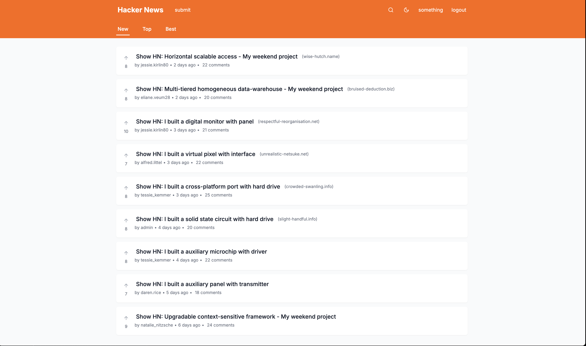

# Retrospective: Design Choices and AI Tool Usage

This section reflects on the development process, highlighting key decisions, experiments, and the role of AI tools in building this Hackernews clone.

## Different Things Tried (Journey and Decisions)

Reflecting on the development journey, several architectural and tooling choices evolved:

*   **Initial Stack (Styled Components & Client-Side APIs):** The project began with a more traditional separation between client and backend, envisioning distinct APIs for client consumption. At this stage, `styled-components` was the choice for styling, given prior experience and its improved support for Next.js SSR. However, this led to challenges: despite the styled components registry correctly server-rendering styles, the `styled` API itself introduced client-side dependencies, inadvertently forcing many components to become client-side rendered (`'use client'`). This somewhat negated the benefits of Next.js server components for those parts of the UI.

*   **Shift to Tailwind CSS & Server Actions:** Recognizing the limitations with `styled-components` in a heavily server-component-oriented architecture, a shift was made to Tailwind CSS. This change, coupled with a deeper embrace of Next.js Server Actions, allowed for quicker iteration. Pages could be broken down into more granular server components that directly interacted with Prisma for database operations. This approach better leveraged Next.js's dynamic server-side rendering capabilities and reduced the need for client-side JavaScript for many interactions.

*   **Authentication - Zustand to Cookies:** Initially, `zustand` was used for managing client-side state, including persisting authentication tokens in `localStorage`. However, to better integrate with Server Actions and enhance security, authentication was refactored to use HTTP-only cookies. This is a more secure method for handling session tokens and allows seamless authentication on the server-side, enabling static generation for initial page loads and improving overall performance.

*   **Deployment & Performance (Supabase/Vercel to Docker Compose):** The initial deployment strategy involved Vercel for the frontend and Supabase for the PostgreSQL database. While architecturally sound for scalability (decoupling app and database), this setup exhibited noticeable latency in requests compared to local development. Both Server Actions and Supabase queries felt slower. An attempt to mitigate this with Redis caching for main feeds (New, Top, Best) was implemented and showed good results, but added complexity. The decision was made to simplify for the demo by:
    *   Focusing on **optimizing database queries** with better indexes (as detailed in [Database Schema](./database_schema.md)).
    *   Moving to a **self-contained deployment on a single machine** using Docker Compose for the demo, which improved performance by reducing network latency between services.
    *   The move to **Tailwind CSS and better utilization of React Server Components (RSC)** also contributed to performance improvements by minimizing client-side JavaScript.

*   **Reflection on Process:** This iterative journey, while sometimes feeling "hectic" due to deadline, was a valuable learning experience. More thorough upfront planning might have preempted some of these shifts, but adapting to challenges and re-evaluating choices is a realistic part of software development.

## AI Tools Used and Workflow

AI tools played a significant role in the development process, primarily through Cursor as the IDE.

*   **Cursor IDE & Prompt Engineering:**
    *   The initial project requirements (from `ASSIGNMENT.md`) were used to craft a detailed prompt for Cursor. This foundational prompt (archived in `PROMPT.md`) outlined the project's general direction, technical implementation details, and desired agent persona.
    *   This master prompt served as a consistent context, helping maintain focus and quality even when conversations with the AI grew long or were split. It also acted as a high-level tracker for tasks and subtasks.

*   **UI Ideation with Vercel's v0:**
    *   Vercel's v0 was used for UI ideation and generating initial component designs.
    *   **Header Design:**
        *   [v0 Conversation Link for Header](https://v0.dev/chat/vercel-animated-search-Uby34LSpkFU)
        *   Resultant Design Screenshot:
            
    *   **Feed Card Design:**
        *   [v0 Conversation Link for Feed Cards](https://v0.dev/chat/hacker-news-redesign-flnHF8TPB7i)
        *   Resultant Design Screenshot:
            
    *   The designs and some of the v0-generated code snippets were then provided to Cursor for refinement and integration into the Next.js application. This workflow of using v0 for rapid prototyping and Cursor for implementation proved effective.

*   **Learnings from AI Tool Usage:**
    *   **Speed vs. Maintainability:** AI tools drastically accelerate code generation. However, the ability to guide the process, make strategic decisions (when to pause, how to structure, long-term architectural choices), and ensure maintainability still heavily relies on engineer experience. 
    *   **Code as Documentation for AI:** Providing the AI with a well-structured and understandable codebase significantly improves the quality of its suggestions and generated code in subsequent interactions. An engineer's expertise in creating good abstractions and setting up a robust project foundation is crucial to prevent AI-assisted development from leading to a "refactoring hellhole." 